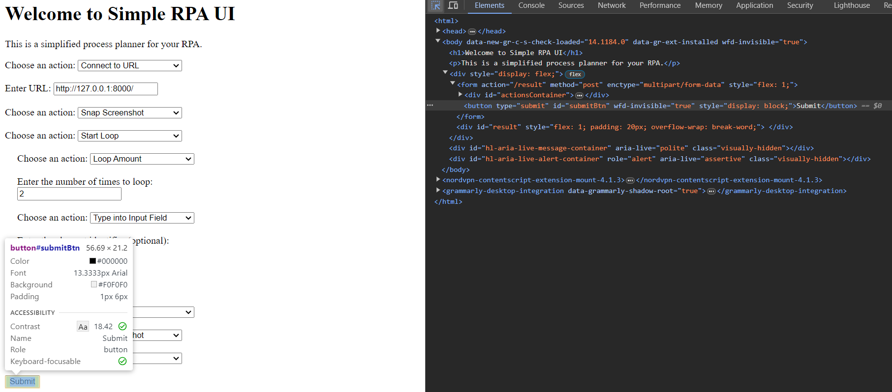

# Simple RPA UI

## Overview

This project provides a simple and intuitive web-based UI to design and execute RPA (Robotic Process Automation) tasks using FastAPI. Users can create workflows by selecting various actions such as connecting to a URL, clicking buttons, typing text, and more. The actions are executed sequentially, and the results are displayed on the same page.

<div align="center">
    
</div>

## Table of Contents

- [Features](#features)
- [Prerequisites](#prerequisites)
- [Installation](#installation)
- [Usage](#usage)
- [Finding Element Identifiers](#finding-element-identifiers)
- [API Endpoints](#api-endpoints)
  - [GET /](#get-)
  - [POST /load_file](#post-load_file)
  - [POST /result](#post-result)
- [Project Structure](#project-structure)
- [Contributing](#contributing)
- [License](#license)
- [Credits](#credits)

## Features

- **Connect to URL:** Open a specified URL.
- **Click on Button:** Simulate a click on a specified element.
- **Right Click on Element:** Simulate a right-click on a specified element.
- **Double Click on Element:** Simulate a double-click on a specified element.
- **Hover on Element:** Simulate hovering over a specified element.
- **Read Text from Element:** Read text from a specified element.
- **Type into Input Field:** Type text into a specified input field.
- **Snap Screenshot:** Capture a screenshot of the current page.
- **Select from Dropdown:** Select an option from a dropdown menu.
- **Load Data from File:** Load data from an uploaded file.
- **Write to File:** Write text to a file. If the file already uploaded before, it appends the text.
- **Ask for Input:** Ask the user for input during the execution.
- **Keyboard Input:** Simulate keyboard input.
- **Send an Email:** Send an email with the result log, including attachments.
- **Start Loop:** Start a loop to repeat actions.
- **Loop Amount:** Specify the number of times to loop actions.
- **End Loop:** End the loop.
- **Done:** Indicate the end of actions.

## Prerequisites

- Python 3.7+
- FastAPI
- Uvicorn
- RPA for Python

## Installation

1. **Clone the repository:**

    ```bash
    git clone https://github.com/anhphan2705/simple-rpa-ui.git
    cd simple-rpa-ui
    ```

2. **Create and activate a virtual environment:**

    ```bash
    python -m venv env
    source env/bin/activate  # On Windows use `env\Scripts\activate`
    ```

3. **Install the required packages:**

    ```bash
    pip install fastapi uvicorn rpa smtplib uuid
    ```

## Usage

1. **Start the FastAPI server:**

    ```bash
    uvicorn main:app --reload
    ```

2. **Open the application in a web browser:**

    Navigate to `http://127.0.0.1:8000` to access the Simple RPA UI.

3. **Create a workflow:**

    - Select actions from the dropdown menu.
    - Fill in the required details for each action.
    - For how to find element signature, refer to [Finding Element Identifiers](#finding-element-identifiers) for more information
    - Add more actions as needed.

4. **Submit the workflow:**

    - Click the "Submit" button to execute the workflow.
    - The results, including screenshots and written files, will be displayed on the results page.

## Finding Element Identifiers

To perform actions on specific elements on a web page, you need to provide the correct element identifier (XPath). Here's how to find the XPath of an element:

1. **Open the web page in Chrome.**
2. **Right-click on the element you want to interact with and select `Inspect` to open the Developer Tools.**
3. **In the Developer Tools pane, right-click on the highlighted element in the HTML structure and select `Copy` -> `Copy XPath`.**

The copied XPath will look something like this:

```xpath
/html/body/div[1]/header/div/nav/ul/li[1]/a
```

You can simplify the XPath if needed. For example, if the element has a unique ID, you can use:

```xpath
//element_type[@id="element_id"]
```

Or, if the element has a unique class:

```xpath
//element_type[@class="element_class"]
```

### Example

For a button with the ID `submit-button`, the XPath would be:

```xpath
//button[@id="submit-button"]
```

Use these XPaths in the `selectors` field when creating your workflow actions.



## API Endpoints

### GET /

Returns the main HTML page for creating and submitting workflows.

### POST /load_file

Handles file uploads and returns the content of the uploaded file.

**Request:**

- `file`: The file to upload (supports `.txt`, `.csv`, `.json`).

**Response:**

- Returns the content of the uploaded file in JSON format.

### POST /result

Handles form submissions and executes the specified actions in sequence.

**Request:**

- `actions`: List of actions to perform.
- `selectors`: List of element selectors (optional).
- `texts`: List of texts to type (optional).
- `options`: List of options to select (optional).
- `ask_texts`: List of questions to ask for user input (optional).
- `keyboard_inputs`: List of keyboard inputs to simulate (optional).
- `email_to`: List of recipient email addresses (required).
- `email_subject`: List of email subjects (optional).
- `email_message`: List of email messages (optional).
- `gmail_id`: List of Gmail IDs (required).
- `gmail_pwd`: List of Gmail passwords (required).
- `loop_counts`: List of loop counts (optional).
- `load_files`: List of files to load data from (optional).
- `write_texts`: List of texts to write (optional).
- `file_names`: List of file names to write to (optional).

**Response:**

- Returns the result page with executed actions and available files for download.

## Project Structure

```
.
├── main.py                 # Main FastAPI application
├── screenshots/            # Directory to store screenshots
├── written_files/          # Directory to store written files
├── LICENSE                 # License file
└── README.md               # This file
```

## Contributing

Feel free to contribute to this project by opening issues or submitting pull requests. Please ensure that your contributions adhere to the project's coding standards and guidelines.

## License

This project is licensed under the Apache 2.0 License. See the LICENSE file for details.

## Credits

This project makes use of the following open-source projects:

- **[RPA for Python](https://github.com/tebelorg/RPA-Python):** A simple and powerful RPA (Robotic Process Automation) library for Python.
- **[FastAPI](https://github.com/tiangolo/fastapi):** A modern, fast, and high-performance web framework for building APIs with Python 3.7+ based on standard Python type hints.